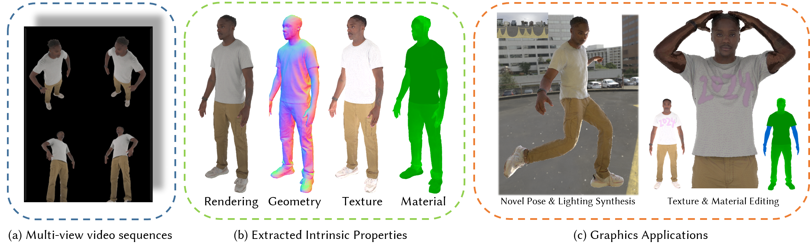

# MeshAvatar: Learning High-quality Triangular Human Avatars from Multi-view Videos (ECCV 2024)

[Yushuo Chen]()<sup>1</sup>, [Zerong Zheng](https://zhengzerong.github.io/)<sup>2</sup>, [Zhe Li](https://lizhe00.github.io/)<sup>1</sup>, Chao Xu<sup>2</sup>, [Yebin Liu](https://www.liuyebin.com)<sup>1</sup>

<sup>1</sup>Tsinghua Univserity <sup>2</sup>NNKosmos Technology

### [Projectpage](https://shad0wta9.github.io/meshavatar-page/) · [Paper](https://arxiv.org/pdf/2407.08414) · [Video](https://youtu.be/Kpbpujkh2iI)



# Installation
1. Install dependencies
```
conda create -n meshavatar python=3.9
conda activate meshavatar

conda install pytorch torchvision torchaudio cudatoolkit=11.6 -c pytorch -c conda-forge
pip install ninja imageio PyOpenGL glfw xatlas gdown
pip install git+https://github.com/NVlabs/nvdiffrast/
pip install --global-option="--no-networks" git+https://github.com/NVlabs/tiny-cuda-nn#subdirectory=bindings/torch
imageio_download_bin freeimage
pip install -r requirements.txt
```

2. Download [SMPL](https://smpl.is.tue.mpg.de/), [SMPL-X](https://smpl-x.is.tue.mpg.de/), and the [model correspondences](https://smpl-x.is.tue.mpg.de/). Organize them in some directory as follow and specify `smpl_dir` in `data_preprocessing/script.py`.
```
smpl_models/
    smpl/
        SMPL_NEUTRAL.pkl
    smplx/
        SMPLX_NEUTRAL.pkl
        SMPLX_NEUTRAL.npz
    model_transfer/
        smplx_to_smpl.pkl
```

3. Download or build `PointInterpolant`. Compile`lbs_surf_grad`, the c++ program for computing surface gradient of LBS weights.
```
git clone https://github.com/mkazhdan/PoissonRecon
cd PoissonRecon
make pointinterpolant
cd ..

cd data_preprocessing/diffused_skinning
sh compile_lbs_surf_grad.sh
cd ../..
```

# Data Preparation

## Data Organization

### AvatarReX Dataset [[link]](https://github.com/lizhe00/AnimatableGaussians/blob/master/AVATARREX_DATASET.md)
Directly download the dataset. If you want to reproduce the experimetns in the paper, please resize the images to `1024x750` first, due to the limited GPU Memory.

### SyntheticHuman++ Dataset [[link]](https://github.com/zju3dv/animatable_nerf)
Since our code only supports SMPL-X model, we have converted the parameters [here](https://drive.google.com/drive/folders/1DRlVlb618zVNfFm7bEgRbafUndJVnrB9?usp=sharing) (using [the official transfer model](https://github.com/vchoutas/smplx/tree/main/transfer_model)).

Run `data_preprocessing/convert_calib.py` to convert the calibration format.

### Custom Dataset
Organize your dataset as AvatarReX dataset:
```
<cam_id_0>/
    mask/pha/
        00000000.jpg
        ...
    00000000.jpg
    ...
<cam_id_1>/
...
<cam_id_n>/
calibration_full.json
smpl_params.npz
```

## Data Preprocessing
Specify `data_dir`, `smpl_file_path` and `dataset_name` in your config file. Then preprocess the dataset by
```
python data_preprocessing/script.py --config <config_file>
```

# Training

Run using single gpu
```
sh run.sh <gpu_id> <config_file>
# Example
sh run.sh 0 configs/jody.json
```
or using multiple gpus ([apex](https://github.com/NVIDIA/apex) should be additionally installed)
```
sh run_multi.sh <gpu_ids> <config_file> (<master_port>, optional)
# Example
sh run_multi.sh 0,1 configs/avatarrex_zzr.json
```
# Testing
Run
```
python test.py --config out/<exp_name>/exp.json
```
Modifiy the arguments in `test.py` to choose any output you want.

# Acknowledgement
Part of our code is borrowed from the following repos, great thanks to them!

* [nvdiffrec](https://github.com/NVlabs/nvdiffrec), [nvdiffrecmc](https://github.com/NVlabs/nvdiffrecmc)
* [Pytorch-UNet](https://github.com/milesial/Pytorch-UNet)
* [fite](https://github.com/jsnln/fite)

# Citation
If you find our code or data is helpful to your research, please consider citing our paper.
```bibtex
@misc{chen2024meshavatar,
    title={MeshAvatar: Learning High-quality Triangular Human Avatars from Multi-view Videos}, 
    author={Yushuo Chen and Zerong Zheng and Zhe Li and Chao Xu and Yebin Liu},
    year={2024},
    eprint={2407.08414},
    archivePrefix={arXiv},
    primaryClass={cs.CV},
    url={https://arxiv.org/abs/2407.08414}, 
} 
```